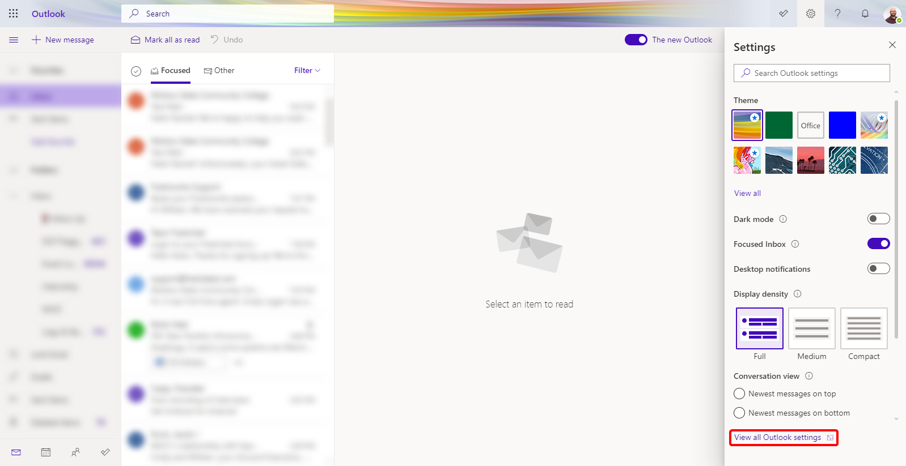
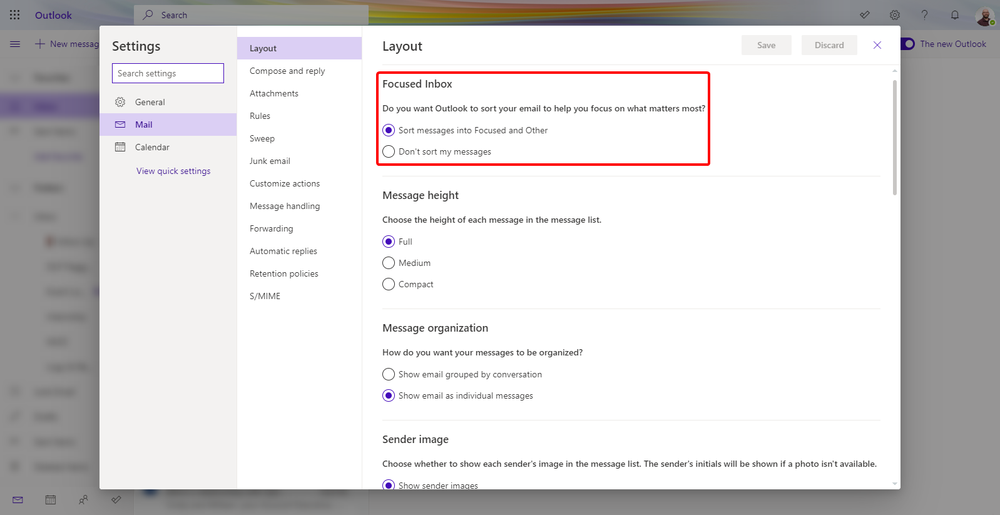
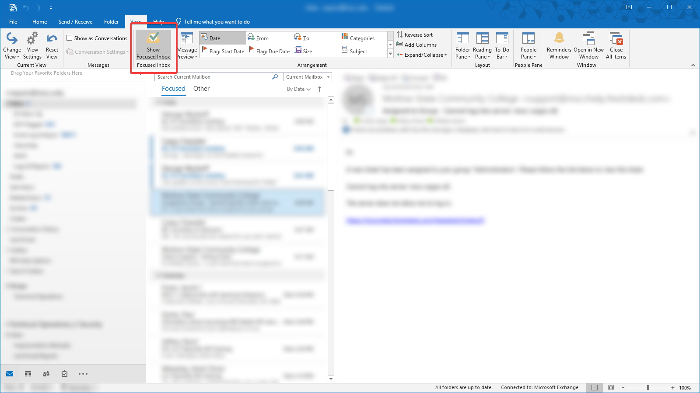
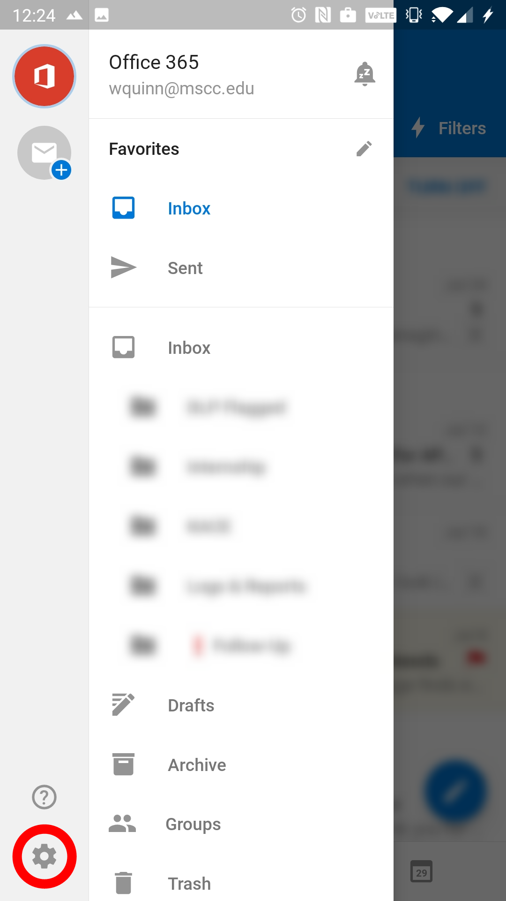
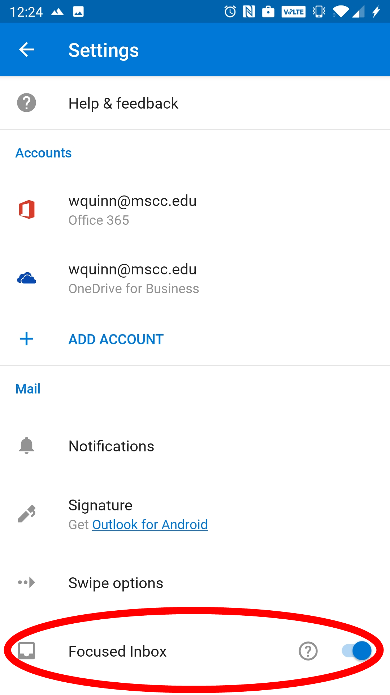

[author]:        <> (William Quinn)
[last modified]: <> (2020-10-12)
[revision]:      <> (1)

# How can I disable Focused Inbox?

## Outlook on the Web

To disable Focused Inbox on Outlook on the Web:

  1. Click on the Settings cog  in the top-right of the screen, then click on the View all Outlook settings link at the bottom of the list.

  

  2. On the Settings page, click on Mail on the left side, then click Layout in the middle column. The Focused Inbox setting should be at the top on the right column. To disable the setting, click on Don't sort my messages.

  

## Outlook Desktop

To disable Focused Inbox on the Outlook Desktop application:

  1. Click on the View tab at the top of the application.
  2. Under the Focused Inbox header, click the button Show Focused Inbox. You should notice that the Focused and Other headers in your Inbox change to All and Unread once you've disabled it.

  

## Outlook Mobile (iOS and Android)

To disable Focused Inbox on the Outlook Mobile application:

  1. Swipe from the left side to open the side panel, then click on the Settings gear at the bottom.

  

  2. On the Settings page, scroll down until you see the Focused Inbox toggle, then tap to disable Focused Inbox.

  
