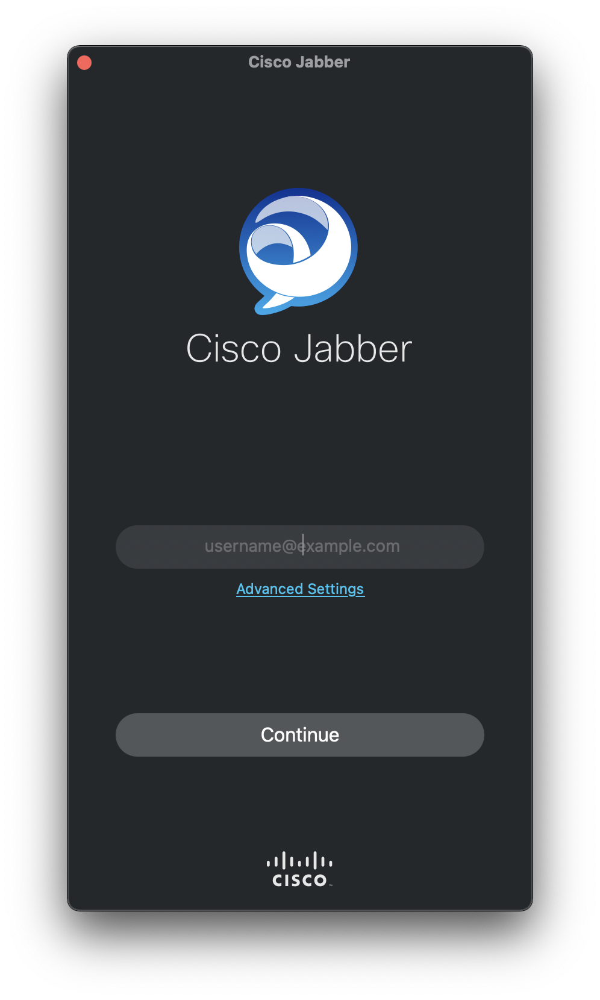
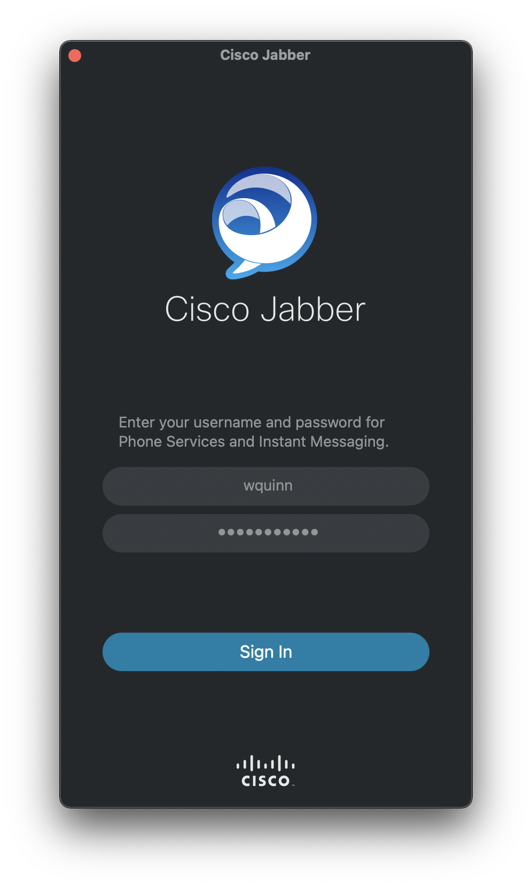
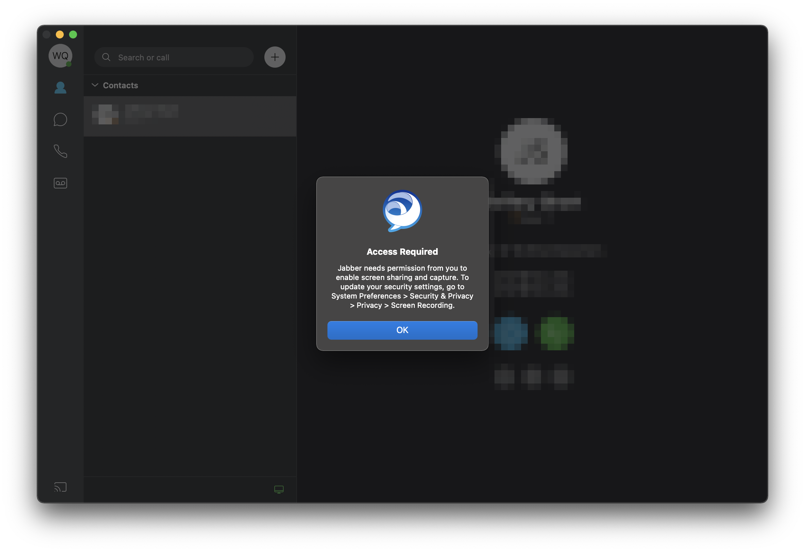
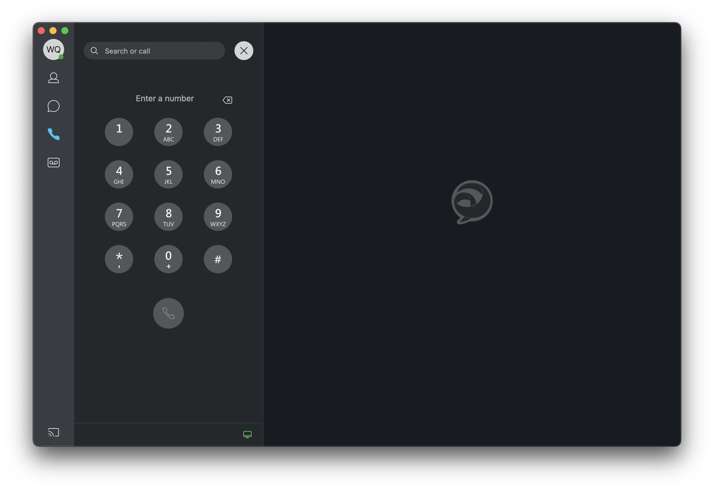
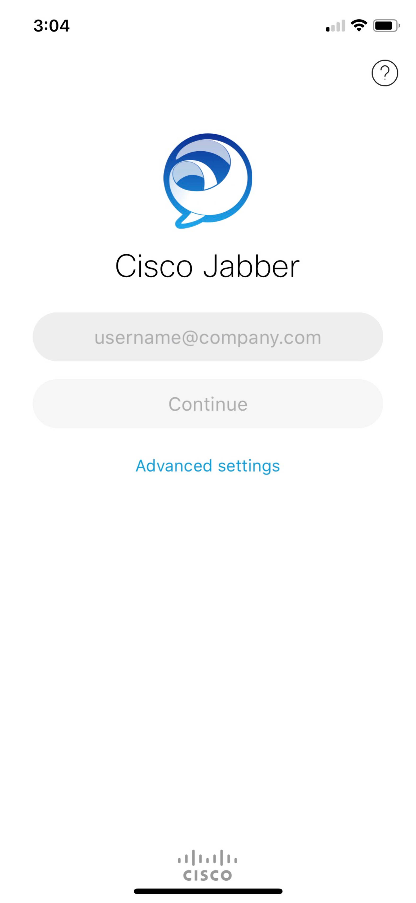
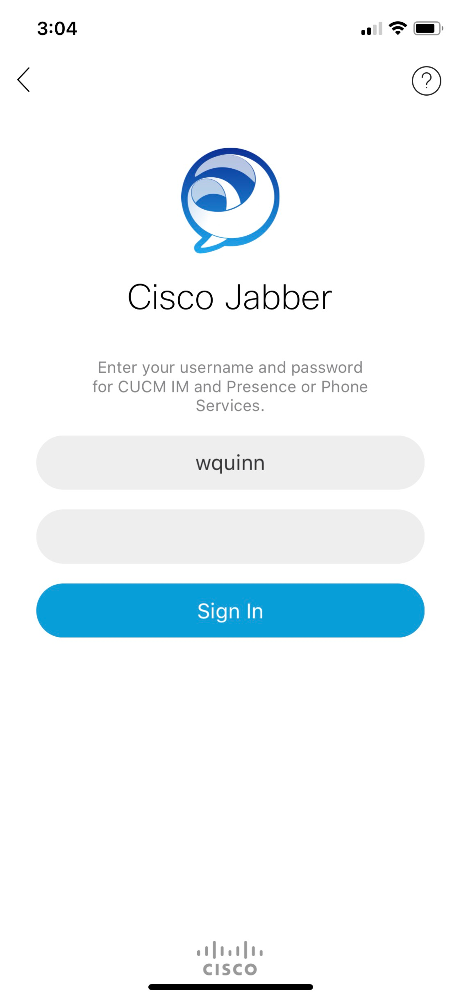
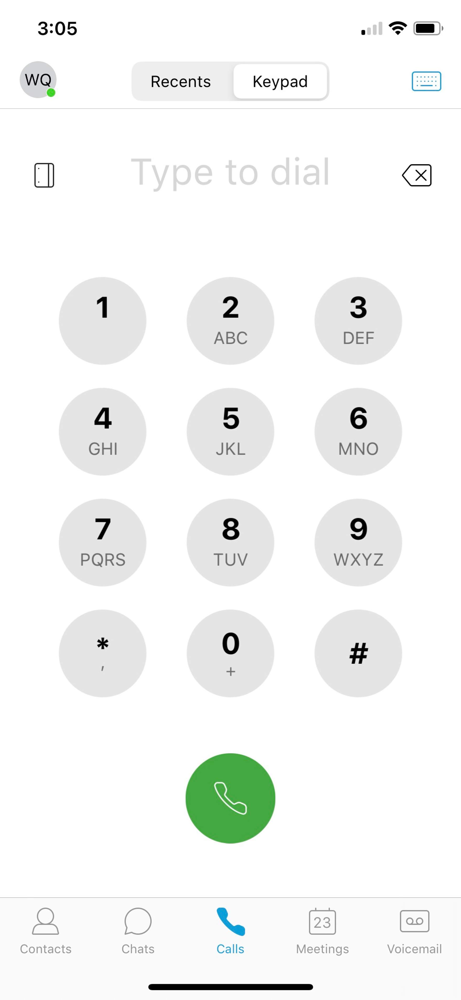

# How can I use the Cisco Jabber clients to utilize my Motlow State phone?

To utilize the Cisco Jabber clients to access your Motlow State phone in new ways, please follow the following instructions.

1. [Submit a ticket](https://support.mscc.edu) with Technical Operations to request a Jabber setup. The ticket needs to include where you plan on using the Cisco Jabber client (Windows PC, Mac, Android, iOS).
    - Technical Operations will then create Jabber profiles for your phone on the backend. This has to be done first, otherwise you will be unable to sign into the Cisco Jabber clients.
2. Install the Cisco Jabber client on your device(s).
    - Windows & Mac: https://www.webex.com/downloads/jabber.html 
        - Click on the blue *Download for* button. 
    - Android: https://play.google.com/store/apps/details?id=com.cisco.im
    - iOS: https://apps.apple.com/us/app/cisco-jabber/id467192391

## Cisco Jabber for Windows & Mac

After installing the Cisco Jabber client for Windows or Mac, you'll first be greeted with the following screen.

Type in your Motlow State email, then click on **Continue**. You should see a similar login window appear.

In this next screen, you'll want to type in your Motlow State username (without the @mscc.edu on the end) and your Motlow State password. This is the same username and password that you use to login to other Motlow State services, such as the Motlow HUB and your computer.

!!! note

    For Mac users, you may see a window appear that requests permission to enable screen sharing and capture. This is safe to ignore.

    

Once you're signed in, you can make a phone call by clicking on the phone icon on the left side, then press the dial pad button beside the *Search or call* field at the top of the application.

## Cisco Jabber for Mobile Devices

After installing the Cisco Jabber client for your mobile device, you'll first be greeted with the following screen.

Type in your Motlow State email, then click on **Continue**. You should see a similar login window appear.

In this next screen, you'll want to type in your Motlow State username (without the @mscc.edu on the end) and your Motlow State password. This is the same username and password that you use to login to other Motlow State services, such as the Motlow HUB and your computer.

Once you're signed in, you can make a phone call by clicking on the phone icon at the bottom of the app, then press the **Keypad** button at the top of the screen.