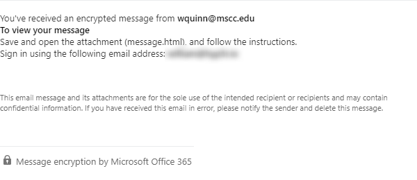

# I received an encrypted message, how do I open this?

If you've opened an email and see one of the following screens, you have been sent an encrypted message. Opening the encrypted message is easy, and this article will help you go through the process.

!!! Example

    
    ---
    

## New Office Message Encryption

If the message you received contains the blue bar with a white Office 365 logo, you've received an encrypted message using the New Office Message Encryption. To open this message, click on the blue **Read the message** button in the middle of the message. You should be taken to a screen that looks similar to the one below.

You'll have two options to open the message - **Sign in with a work or school account** or **Sign in with a one-time passcode**. Technical Operations recommends selecting the **Sign in with a one-time passcode** option. Once you click on that link, Office 365 will send you an email with a one-time code that you'll need to supply. Once that's done, you'll be able to view and reply to the message.

## Old Office Message Encryption

If the message you received contains the message *Save and open the attachment (message.html), and follow the instructions.* at the middle of the page with a gray padlock and the phrase *Message encryption by Microsoft Office 365* at the bottom, you've received an encrypted message using the Old Office Message Encryption. To open this message, you'll want to save the **message.html** attachment from the email, then open the attachment. You should see a window similar to the one below.

You'll have two options to open the message - **Sign in** or **Use a one-time passcode**. Technical Operations recommends selecting the **Use a one-time passcode** option. Once you click on that link, Office 365 will send you an email with a one-time code that you'll need to supply. Once that's done, you'll be able to view and reply to the message.
